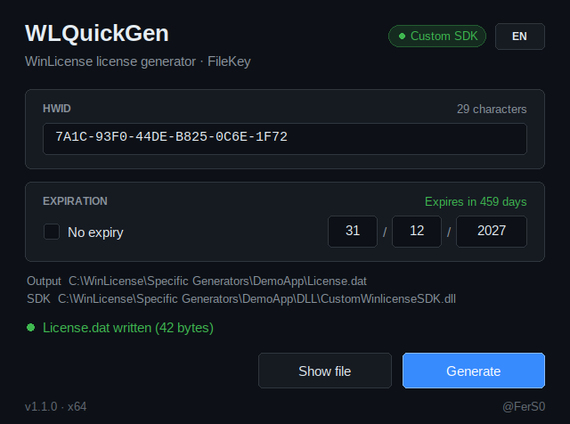
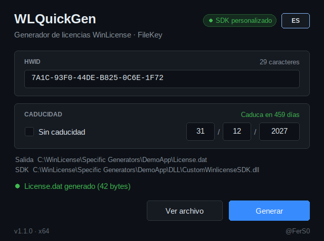
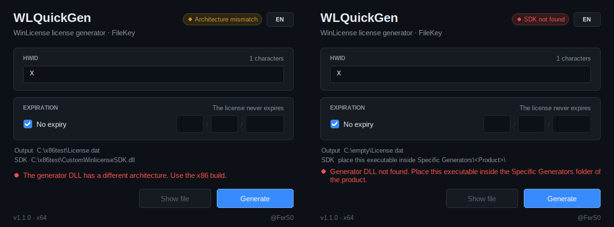
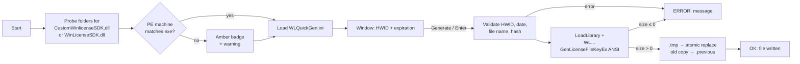

# WLQuickGen

A small, portable license generator for products protected with
[WinLicense](https://www.oreans.com/WinLicense.php).

Drop a single `.exe` into the `Specific Generators\<Product>\` folder that
WinLicense creates, paste the target machine's HWID, press **Generate**, and the
license file is written next to the executable.

It is a leaner replacement for the `WLGen_<Product>.exe` generator that
WinLicense ships: same official SDK exports, one screen, and built for UI
automation.

Current version: **1.1.0** — see the [changelog](CHANGELOG.md).



## Why

When you already have many protected products, re-protecting each one just to
change how licenses are issued is expensive. WLQuickGen needs nothing from the
product: it only uses the generator DLL that WinLicense already produced for it.

## Features

- **Portable** — one executable per generator folder, no installation, static
  runtime (no VC++ redistributable).
- **Auto-detects the SDK** — finds `CustomWinlicenseSDK.dll` (custom generator,
  no license hash needed) or `WinLicenseSDK.dll` (standard generator), and warns
  up front when its architecture does not match the executable.
- **Dark card-based UI** — same design language as GET_HWID: rounded cards,
  hover-aware buttons, SDK badge, colored status line, dark title bar on
  Windows 10/11, live expiration summary ("Expires in 459 days").
- **Multi-language** — English, Spanish and Portuguese. Follows the Windows
  display language and can be switched live with the `EN`/`ES`/`PT` button
  (the choice is remembered in `WLQuickGen.ini`).
- **Automation friendly** — stable control IDs, no modal dialogs, results
  reported as text with language-independent `OK:` / `ERROR:` prefixes. Works
  out of the box with `pywinauto`.
- **x86 and x64 builds** — match the architecture of the generator DLL.
- **Safe writes** — atomic replace, previous license kept as `.previous`.

| Spanish interface | Detected problems |
|---|---|
|  |  |

## Usage

1. Download the build matching your generator DLL's architecture (usually x86)
   from the [releases](https://github.com/FerS00/WLQuickGen/releases) and copy it
   into the product folder, e.g. `...\Specific Generators\DPP\`.
2. Run it once — it creates `WLQuickGen.ini` next to itself.
3. Set the license file name in that ini (see below).
4. Paste the HWID, choose the expiration, press **Generate** (or Enter).
5. **Show file** opens Explorer with the new license selected.

The tool searches for the SDK in its own folder, in `DLL\` and `EXE\`, in the
parent folder, and one level of product subfolders — so it works whether you put
it in the product root or in `Specific Generators\` next to several products.

A step-by-step guide in Spanish is in [docs/MANUAL_USUARIO.md](docs/MANUAL_USUARIO.md).

## How it works



More diagrams (SDK search order, status states, language resolution) are in
[docs/GRAFO_LOGICA.md](docs/GRAFO_LOGICA.md).

## Configuration (`WLQuickGen.ini`)

Everything that does not change per license lives here, which keeps the window
minimal:

```ini
[WLQuickGen]
LicenseFileName=License.dat
NameIsHwid=1
Name=
Organization=
CustomData=
LicenseHash=
Language=auto
```

| Key | Meaning |
|---|---|
| `LicenseFileName` | Name of the generated file. Products differ — set it once per folder. |
| `NameIsHwid` | `1` uses the HWID as the registration name (what the stock generator does). `0` uses `Name`. |
| `Name` / `Organization` / `CustomData` | Optional license fields. Empty means "not set" (`NULL`), which is not the same as an empty string to the SDK. |
| `LicenseHash` | Required **only** for the standard SDK (`WinLicenseSDK.dll`). The custom DLL embeds it. |
| `Language` | `auto` (Windows display language, English fallback), `en`, `es` or `pt`. The language button writes it. |

## Automation with pywinauto

No modal dialogs are ever shown; the status line reports the outcome and starts
with `OK:` or `ERROR:`. Those prefixes stay the same in every language — only
the text after them is translated, so match on the prefix.

| Control | `control_id` | Class |
|---|---|---|
| HWID | 1002 | Edit |
| No expiry | 1006 | Button (checkbox) |
| Day / Month / Year | 1007 / 1008 / 1009 | Edit |
| Generate | 1011 | Button |
| Status | 1012 | Static |
| Show file | 1013 | Button |
| Language | 1015 | Button |

Window class `WLQuickGenWindow`, title `WLQuickGen`.

```python
from pywinauto.application import Application
import time

app = Application(backend="win32").start(r"...\DPP\WLQuickGen-x86.exe")
dlg = app.window(class_name="WLQuickGenWindow")
dlg.wait("ready", timeout=10)

dlg.child_window(control_id=1002, class_name="Edit").set_edit_text(hwid)
dlg.child_window(control_id=1011, class_name="Button").click()
time.sleep(1)

status = dlg.child_window(control_id=1012, class_name="Static").window_text()
assert status.startswith("OK:"), status
dlg.close()
```

A ready-to-run version is in [`examples/automate.py`](examples/automate.py).

> Use 32-bit Python to drive the x86 build; pywinauto warns otherwise (it still
> works for these controls, but matching bitness is more reliable).

## Building

Details in Spanish: [docs/COMPILACION.md](docs/COMPILACION.md).

**Visual Studio (`build.bat`)** — requires the C++ toolset (x86 and x64) and the
Windows SDK (`rc.exe`):

```
build.bat
```

Produces `WLQuickGen-x86.exe` and `WLQuickGen-x64.exe`. If Visual Studio is not
in the default location, edit `VCVARS` at the top of `build.bat`.

**CMake**:

```
cmake -S . -B build-x64 -A x64   && cmake --build build-x64 --config Release
cmake -S . -B build-x86 -A Win32 && cmake --build build-x86 --config Release
```

Binaries land in `build-*/bin/Release/`.

## Releases

[`.github/workflows/release.yml`](.github/workflows/release.yml) builds x86 and
x64 on every push and pull request. Pushing a `v*` tag (or running the workflow
manually with *release* ticked) publishes a GitHub release with
`WLQuickGen-<version>-windows-<arch>.zip`, its SHA-256, and the matching section
of [CHANGELOG.md](CHANGELOG.md) as notes.

To cut a release: bump the version in `CMakeLists.txt`, `src/theme.h` and
`WLQuickGen.rc`, add a `## [x.y.z]` section to the changelog, then tag.

## ⚠️ Do not commit WinLicense material

This repository contains **only** the generator's own source. The `.gitignore`
blocks the files that carry your product's generation secrets:

- `CustomWinlicenseSDK.dll`, `WinLicenseSDK.dll`, `ECCfunctions.dll`
- `GeneratorSeed.gns`, `GeneratorDatabase.abs`
- `WLQuickGen.ini` (may contain `LicenseHash`)
- generated `.dat` / `.txt` / `.reg` license files

Publishing any of those would let anyone generate licenses for your product.
Check `git status` before your first push.

## Notes and limits

- The executable's architecture **must** match the generator DLL's. A 32-bit
  process cannot load a 64-bit DLL. The tool detects this at startup (amber
  badge) and names the build to use.
- Supported family: **FileKey** (license file). TextKey, Registry, SmartKey and
  Dynamic SmartKey are out of scope.
- The tool calls the **ANSI** SDK exports (`WLCustomGenLicenseFileKeyEx` /
  `WLGenLicenseFileKeyEx`). The Unicode variants embed the name as UTF-16 and
  produce a file the protected product rejects as a corrupt license.
- Licenses are not deterministic: generating twice with identical input yields
  different bytes. Compare sizes, not bytes.
- Binaries are not Authenticode-signed.

## License

Not chosen yet — add one before publishing.
