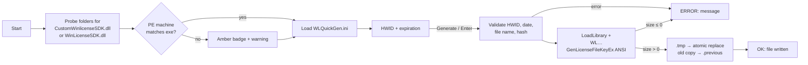

# WLQuickGen
**Portable FileKey license generator for WinLicense-protected products**  
*Single-screen Win32 front end over the generator DLL that WinLicense already builds per product — no re-protection, no installer, automation-ready.*


---

### Overview
> Dropped into `Specific Generators\<Product>\`, the executable locates the product's generator DLL, takes a HWID and an expiration, and writes the license file next to itself. It replaces the stock `WLGen_<Product>.exe` using the same official SDK exports, adds pre-flight validation, and exposes stable control IDs and prefix-coded status text so it can be driven by `pywinauto`.

---

### Key Engineering Decisions / Architecture
- **SDK discovery and PE check:** probes its own folder, `DLL\`, `EXE\`, the parent folder and one level of product subfolders for `CustomWinlicenseSDK.dll` (hash embedded) or `WinLicenseSDK.dll` (requires `LicenseHash`). It reads the PE `Machine` field and flags a 32/64-bit mismatch before any `LoadLibrary` attempt, naming the build to use.
- **ANSI exports on purpose:** calls `WLCustomGenLicenseFileKeyEx` / `WLGenLicenseFileKeyEx`. The `…ExW` variants embed the name as UTF-16 and yield a file the protected product rejects as corrupt.
- **`NULL` vs empty string:** empty `Name` / `Organization` / `CustomData` in the ini are passed as `NULL` ("not set"), which the SDK treats differently from `""`.
- **Atomic writes:** output goes to `.tmp`, then `MoveFileExW(MOVEFILE_REPLACE_EXISTING | MOVEFILE_WRITE_THROUGH)`; the previous license is copied to `.previous`. Returned size `≤ 0` is reported as an error, never written.
- **Automation contract:** no modal dialogs; fixed control IDs (`1002` HWID, `1011` Generate, `1012` Status…); status lines start with language-independent `OK:` / `ERROR:` prefixes.
- **Zero-dependency binary:** static CRT (`/MT`), Common Controls 6 + DPI-aware manifest, double-buffered GDI painting (`CreateCompatibleDC`), dark title bar on Windows 10/11; EN/ES/PT resolved from the Windows display language and switchable at runtime.
- **Secret hygiene:** generator DLLs, seeds (`*.gns`, `*.abs`), `WLQuickGen.ini` (may hold `LicenseHash`) and generated licenses are blocked by `.gitignore` — publishing them would allow anyone to mint licenses.



---

### Tech Stack
| Layer | Technologies |
| :--- | :--- |
| **Application** | `C++17` · `Win32 API` · `GDI` · `Common Controls 6` · `Shell API` |
| **Build** | `CMake` · `MSVC` (`build.bat`, `/MT /utf-8 /W4`) · `MinGW` cross-compile |
| **CI / release** | `GitHub Actions` (`windows-2022`, x86/x64 matrix, PE architecture check, zipped artifacts + SHA-256) |
| **Automation example** | `Python` · `pywinauto` |
| **External (not included)** | WinLicense generator SDK by Oreans — see [THIRD_PARTY_NOTICES.md](THIRD_PARTY_NOTICES.md) |

---

### Quickstart
Requirements: Visual Studio C++ toolset (x86 + x64) and Windows SDK, or CMake.

```powershell
build.bat                                               # -> WLQuickGen-x86.exe, WLQuickGen-x64.exe

cmake -S . -B build-x64 -A x64   ; cmake --build build-x64 --config Release
cmake -S . -B build-x86 -A Win32 ; cmake --build build-x86 --config Release
```

Usage: copy the build matching the generator DLL (usually x86) into `...\Specific Generators\MyProduct\`, run it once to create `WLQuickGen.ini`, set `LicenseFileName`, paste the HWID and press **Generate**.

```ini
[WLQuickGen]
LicenseFileName=License.dat
NameIsHwid=1
Name=
Organization=
CustomData=
LicenseHash=
Language=auto
```

Scope: FileKey licenses only (TextKey, Registry, SmartKey and Dynamic SmartKey are out of scope). Licenses are non-deterministic — compare sizes, not bytes. Binaries are not Authenticode-signed. Releases are published by pushing a `v*` tag.

Configuration reference, `pywinauto` example and control table: [docs/PROJECT_GUIDE.md](docs/PROJECT_GUIDE.md) · Build details: [docs/COMPILACION.md](docs/COMPILACION.md) · Diagrams: [docs/GRAFO_LOGICA.md](docs/GRAFO_LOGICA.md) · [CHANGELOG.md](CHANGELOG.md)

---

### License
Source-available under the [PolyForm Noncommercial License 1.0.0](LICENSE) — not an OSI-approved open source license.

> Source code is available under the PolyForm Noncommercial License 1.0.0. Commercial use requires a separate license from the copyright holder.

Commercial use: [COMMERCIAL-LICENSE.md](COMMERCIAL-LICENSE.md). WinLicense is a product of Oreans Technologies and is not distributed here.

Required Notice: Copyright (c) 2026 FerS00 (https://github.com/FerS00)

**Author:** [FerS00](https://github.com/FerS00)
