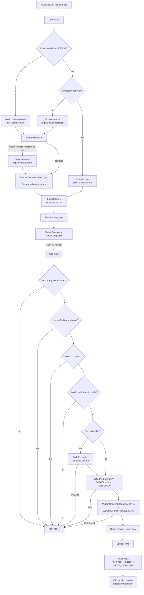
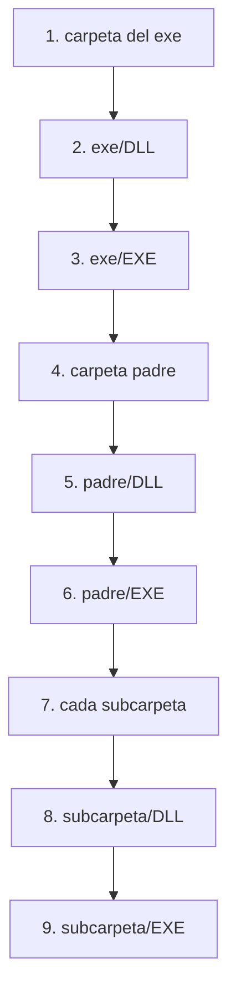
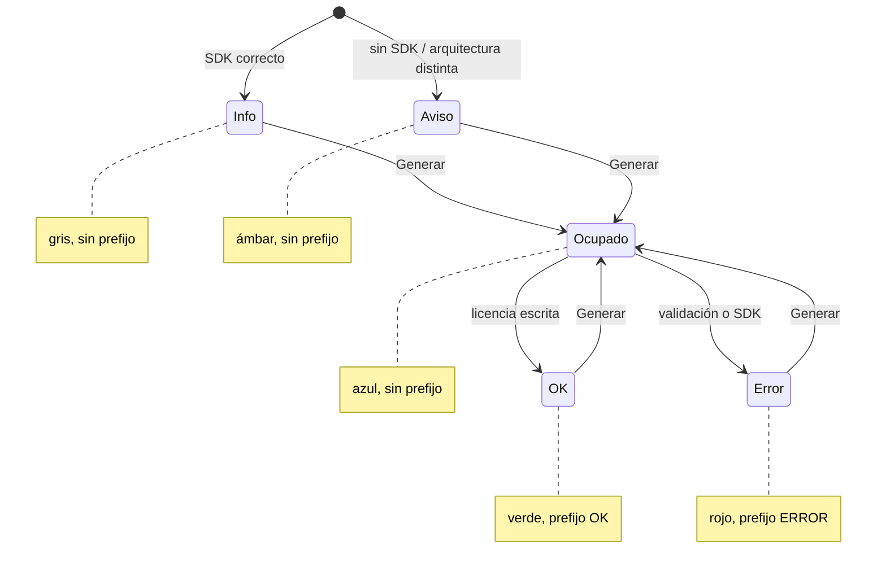
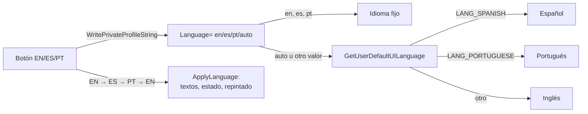
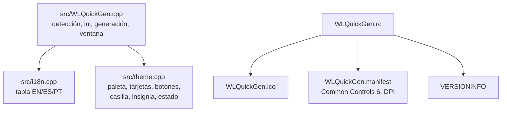

# Grafo lógico de WLQuickGen

Mapa corto de la implementación (`src/WLQuickGen.cpp`, `src/theme.cpp`, `src/i18n.cpp`).

## Flujo principal

## Orden de búsqueda del SDK

`FindRelative` prueba cada raíz en este orden y devuelve la primera coincidencia.
`CustomWinlicenseSDK.dll` se busca en todas las raíces antes que `WinLicenseSDK.dll`.

## Línea de estado

El texto del control `1012` es el contrato para la automatización. Los prefijos
`OK:` y `ERROR:` nunca se traducen; en pantalla se sustituyen por un punto de color.

## Idioma

El estado se guarda como clave (`Text`) más argumentos, no como cadena ya
traducida; por eso al cambiar de idioma el mensaje actual se vuelve a mostrar en
el idioma nuevo sin perder su resultado.

## Módulos

